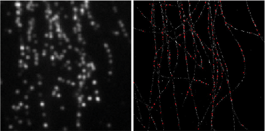

# Deep-STORM

This code accompanies the paper: [Deep-STORM: Super resolution single molecule microscopy by deep learning](https://www.osapublishing.org/optica/fulltext.cfm?uri=optica-5-4-458&id=385495)

# Contents

- [Overview](#overview)
- [System requirements](#system-requirements)
- [Installation instructions](#installation-instructions)
- [Usage and demo examples](#usage-and-demo-examples)
- [Colab notebook](#colab-notebook)
- [Citation](#citation)
- [License](#license)
- [Contact](#contact)

# Overview

Deep-STORM is a single molecule localization microscopy code for training a custom fully convolutional neural network estimator and recovering super-resolution images from dense blinking movies:

.")

# System requirements

* The software was tested on a *Linux* system with Ubuntu version 16.04, and a *Windows* system with Windows 10 Home.  
* Training and evaluation were run on a standard workstation equipped with 32 GB of memory, an Intel(R) Core(TM) i7 − 8700, 3.20 GHz CPU, and a NVidia GeForce Titan Xp GPU with 12 GB of video memory.
* Prerequisites
    1. ImageJ >= 1.51u with ThunderSTORM plugin >= 1.3 installed.
    2. Matlab >= R2017b with image-processing toolbox.
    3. Python >= 3.5 environment with Tensorflow >= 1.4.0, and Keras >= 1.0.0 installed.

# Installation instructions

* ImageJ and ThunderSTORM
    1. Download and install ImageJ 1.51u - The software is freely available at "https://imagej.nih.gov/ij/download.html"
    2. Download ThunderSTORM plugin ".jar" file from "https://zitmen.github.io/thunderstorm/"
    3. Place the downloaded ".jar" file into ImageJ plugins directory
    * To verify ThunderSTORM is setup correctly, open ImageJ and navigate to the Plugins directory. The ThunderSTORM plugin should appear in the list.

* Matlab can be downloaded at "https://www.mathworks.com/products/matlab.html"

* Python environment
    1. The [conda](https://docs.conda.io/en/latest/) environment for this project is given in `environment_<os>.yml` where `<os>` should be substituted with your operating system. For example, to replicate the environment on a linux system use the command: `conda env create -f environment_linux.yml` from within the downloaded directory. This should take a couple of minutes.
    2. After activation of the environment using: `conda activate deep-storm`, you're set to go!

# Usage and demo examples

* To train a network, the user needs to perform the following steps:
    1. Simulate a tiff stack of data frames, with known ground truth positions in an accompanying csv file, using ImageJ ThunderSTORM plugin. The simulated images and positions are saved for handling in Matlab.
    2. Generate the training examples matfile in matlab using the script `GenerateTrainingExamples.m`.
    3. Open up the anaconda command prompt, and activate the previously created `deepstorm` environment by using the command: `activate deepstorm`.
    4. Train a convolutional neural network for the created examples using the command: `python Training.py --filename <path_of_the_generated_training_examples_mfile> --weights_name <path_for_saving_the_trained_weights_hdf5_file> --meanstd_name <path_for_saving_the_normalization_factors_mfile>`

* To use the trained network on data for image reconstruction from a blinking movie, run the command: `python  Testing.py --datafile <path_to_tiff_stack_for_reconstruction> --weights_name <path_to_the_trained_model_weights_as_hdf5_file> --meanstd_name <path_to_the_saved_normalization_factors_as_mfile> --savename <path_for_saving_the_Superresolution_reconstruction_matfile> --upsampling_factor <desired_upsampling_factor> --debug <boolean (0/1) for saving individual predictions>`
    * Note: The inputs `upsampling_factor` and `debug` are optional. By default, the `upsampling_factor` is set to 8, and `debug` is set to 0.
 
* There are 2 different demo examples that demonstrate the use of this code:
    1. `demo1 - Simulated Microtubules` - learning a CNN for localizing simulated microtubules structures obtained from the EPFL 2013 Challenge (Fig. 4 main text). It takes approximately 2 hours to train a model from scratch on a Titan Xp. See the [**pdf instructions**](https://github.com/EliasNehme/Deep-STORM/blob/master/demo1 - Simulated Microtubules/demo1.pdf) inside this folder for a detailed step by step application of the software, with snapshots and intermediate outputs.
    2. `demo2 - Real Microtubules` - pre-trained CNN on simulations for localizing experimental microtubules (Fig. 6 main text).

# Colab notebook

* In case you do not have a GPU-installed workstation and/or do not have a Matlab license, we have recently (June 2020) collaborated with the [Jacquemet](https://cellmig.org/) and the [Henriques labs](https://henriqueslab.github.io/) to incorporate Deep-STORM into the [ZeroCostDL4Mic](https://www.biorxiv.org/content/10.1101/2020.03.20.000133v2) platform as a [Colab notebook](https://github.com/HenriquesLab/ZeroCostDL4Mic/wiki/Deep-STORM). Users are **encouraged** to work with the notebook version of the software as it allows 3 significant advantages over this implementation:

    1. The user does not need to have access to a GPU-acccelerated workstation as the computation is performed freely on the cloud. 
    2. No prior installation is required, as the packages are installed automatically in the notebook. 
    3. Deep-STORM is extended to output *localizations* instead of directly outputting the super-resolved image. This feature is valuable for users intending to use the localizations afterwards for down stream analysis (e.g. single-particle-tracking).



# Citation

If you use this code for your research, please cite our paper:
```
@article{nehme2018deep,
  title={Deep-STORM: super-resolution single-molecule microscopy by deep learning},
  author={Nehme, Elias and Weiss, Lucien E and Michaeli, Tomer and Shechtman, Yoav},
  journal={Optica},
  volume={5},
  number={4},
  pages={458--464},
  year={2018},
  publisher={Optical Society of America}
}
```
**Important Disclaimer**: When using the notebook implementation of Deep-STORM please also cite the [ZeroCostDL4Mic paper](https://www.biorxiv.org/content/10.1101/2020.03.20.000133v2).

# License
 
This project is covered under the [**MIT License**](https://github.com/EliasNehme/Deep-STORM/blob/master/LICENSE).

# Contact

To report any bugs, suggest improvements, or ask questions, please contact me at "seliasne@campus.technion.ac.il"
